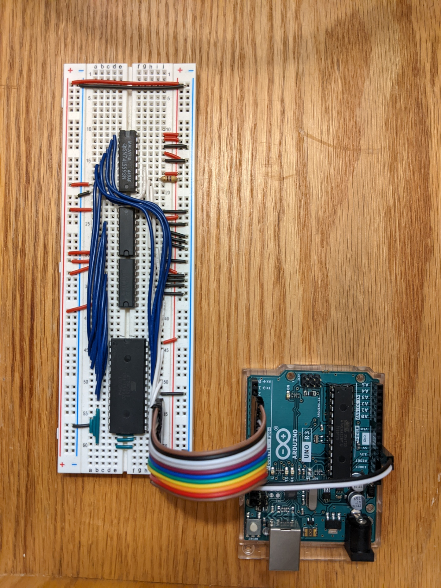

# Arduino EEPROM Programmer
This short Arduino program can be used to read and write EEPROMs. Specifically, I use an Arduino Uno R3 and AT28C256 EEPROM.

## The Breadboard
The other chips are a 74LS593 (8-bit counter) and 2x 74HCT161 (4-bit counter) because that's what I had available.



## Use on Windows
1. Open a command prompt: Press Win+R, type "cmd", press enter.
2. Check which COM port the Arduino is connected to. List all connected ports using the `mode` command. For me, it's COM3
3. Configure the port in this way:
   ```
   mode COM3 baud=57600 parity=n data=8 stop=1 to=on dtr=on rts=on
   ```

### Reading
- In order to read the EEPROM to a file, first run the command `type COM3 > filename`, then press the reset button on the Arduino. When the integrated LED is lit, press ctrl+c to break the TYPE command. This should result in a 32K file.

### Writing
- In order to write a file to the EEPROM, first press the reset button on the Arduino. After the integrated LED is lit, it is ready to receive data. Use the command `type filename > COM3` to transmit a file to the EEPROM. The file to write should be at most 32K in size. The writing process should take only a few seconds
